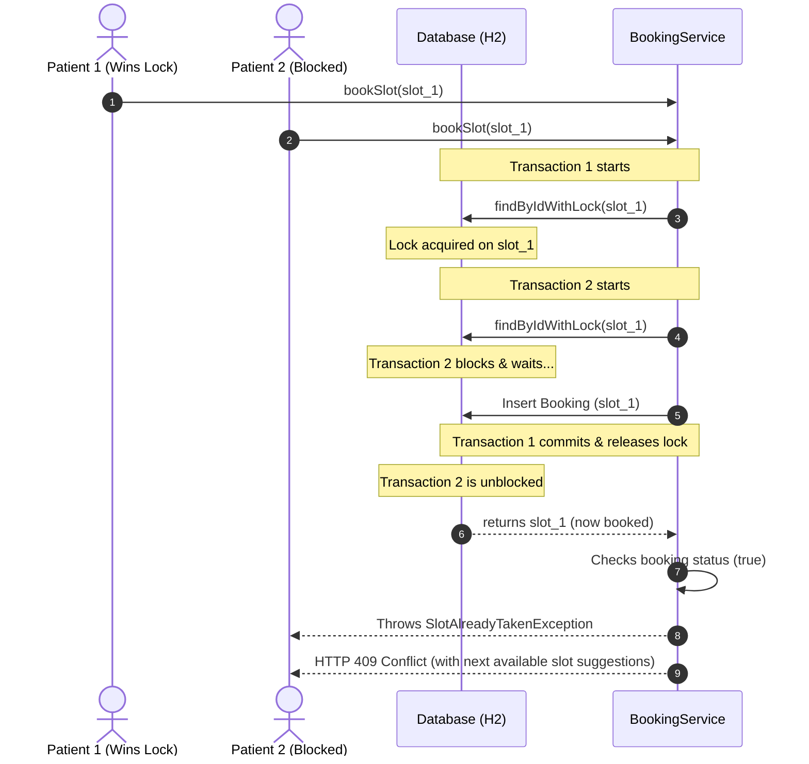

# Healio

Healio is a doctor appointment booking and clinical consultation platform built with Spring Boot and React. The core engineering focus is on concurrency-safe slot bookings and an AI-powered triage and prescription formatting room using the Groq API (Llama 3.1).

## Live Demo

https://healio-gray.vercel.app/

---

## Architecture & System Design

```
+-------------------------------------------------------+
|                   React Frontend                      |
+-------------------------------------------------------+
                           |  (JSON over REST)
                           v
+-------------------------------------------------------+
|                Spring Boot Controller                 |
| - AuthController     - DoctorController               |
| - BookingController  - HealthSummaryController        |
| - AIController                                        |
+-------------------------------------------------------+
                           |
                           v
+-------------------------------------------------------+
|                     Service Layer                     |
| - AuthService        - DoctorService                  |
| - BookingService     - HealthSummaryService           |
| - GroqService                                         |
+-------------------------------------------------------+
         |                                     |
         | (Spring Data JPA)                   | (HTTP Client)
         v                                     v
+-------------------------+          +------------------+
|      Database (H2)      |          |     Groq API     |
| - slots    - bookings   |          | (Llama-3.1-8b)   |
| - users    - doctors    |          +------------------+
+-------------------------+
```

### System Component Breakdown

- **REST Controllers (`com.ambula.*`)**: Handles HTTP entry points and requests, validates DTO inputs, and maps backend domain exceptions to clean HTTP responses (for example, converting booking conflicts to `409 Conflict`).
- **Service Layer (`com.ambula.*`)**: Handles business logic, controls transaction contexts, manages resource locks, and coordinates external calls to the Groq API.
- **Repository/JPA Layer (`com.ambula.*`)**: Manages interaction with the database using Spring Data JPA. This layer declares database query specifications, row locking behaviors, and custom queries.
- **H2 Database**: Runs locally as an embedded file-based relational database operating in PostgreSQL mode.

---

## Preventing Double-Bookings (Concurrency Control)

### The Challenge

In scheduling platforms, it is common for multiple users to attempt to book the same popular slot at the exact same instant. Double-booking a slot is a critical system failure that breaks trust between providers and patients.

### Choosing Pessimistic Locking over Optimistic Locking

To guarantee that a slot can never be booked twice under concurrent conditions, this system implements a database-level **Pessimistic Write Lock** (`SELECT ... FOR UPDATE` via Hibernate `@Lock(LockModeType.PESSIMISTIC_WRITE)`).

- **Optimistic Locking (`@Version`):** Version checks happen at commit time. Under high contention (e.g., 10 users booking a single open slot simultaneously), 9 transactions would perform validation and query the database only to fail at commit time. This wastes application and database server CPU cycles on doomed work, and leads to a frustrating user experience.
- **Pessimistic Locking (`PESSIMISTIC_WRITE`):** The first transaction to call `findByIdWithLock` immediately acquires a write lock on the target slot row. Any concurrent transaction attempting to query or write that same row blocks and waits at the database level until the holding transaction either commits or rolls back. 

In booking systems, ensuring absolute data consistency is more important than raw concurrency throughput. A small latency delay (waiting for a lock to clear) is a much better trade-off than transaction failure or a silent double-booking.

### Fail-Safe: Unique Database Constraint

As a fallback layer, the database enforces a `UNIQUE(slot_id)` constraint on the `bookings` table. This serves as a final safety check. Even if validation logic gets bypassed (due to misconfiguration or isolation level differences), the H2/Postgres engine will reject the second transaction with a unique constraint violation.

### End-to-End Conflict Flow



1. When a concurrent request is blocked and then rejected, the API throws a `SlotAlreadyTakenException` which resolves to a `409 Conflict` status. This response carries metadata suggesting the doctor's **next available slot**.
2. The React frontend catches this `409` response, parses the suggested slot ID and time.
3. The UI automatically displays a recommendation card (e.g., *"That slot was just booked! Next available: Friday, June 12 at 10:30 AM"*) and pre-selects the recommended slot for user confirmation.

---

## AI Features (Powered by Groq Llama 3.1)

### 1. Symptom-to-Specialist Suggester
Patients input unstructured descriptions of their symptoms. The app uses Llama 3.1 with system prompts to identify the matching doctor specialization and write a simple medical triage justification.
* **Clinical Limit:** LLM categorization is suggestive only. It is not a clinical diagnosis. It guides patients to the correct scheduling page but warns them that triage suggestions must be reviewed by a human healthcare provider.

### 2. AI Prescription Formatter
Doctors dictate or type messy consultation notes (e.g., *"give aspirin 75mg once daily after meals for 10 days, patient needs rest, follow up next week"*). The model outputs structured JSON separating the diagnosis, a structured medications table, general lifestyle advice, and follow-up times.
* **Clinical Limit:** The formatted output is a draft formatting-only tool. LLMs are subject to hallucination. Doctors must thoroughly review, modify, and authorize the generated structured prescription details before saving it to the patient's record.

---

## Codebase Structure

### Backend (`backend/src/main/java`)
* **Entities**:
  - [Booking.java](backend/src/main/java/com/ambula/booking/Booking.java): Models the scheduling table with a `UNIQUE(slot_id)` database mapping.
  - [Slot.java](backend/src/main/java/com/ambula/slot/Slot.java): Manages the start, end, and blocked status of calendar slots.
* **Concurrency Locking**:
  - [SlotRepository.java](backend/src/main/java/com/ambula/slot/SlotRepository.java): Contains the pessimistic lock method `findByIdWithLock(id)`.
* **Services**:
  - [BookingService.java](backend/src/main/java/com/ambula/booking/BookingService.java): Manages transaction contexts and coordinates slot validation and locking.
  - [GroqService.java](backend/src/main/java/com/ambula/ai/GroqService.java): Integrates HTTP-based completions via JSON mode prompts.
* **Controllers**:
  - [BookingController.java](backend/src/main/java/com/ambula/booking/BookingController.java): Converts slot conflicts into JSON conflict suggestions.

### Frontend (`frontend/src`)
* [axios.js](frontend/src/api/axios.js): Intercepts `401 Unauthorized` API responses to coordinate session renewal.
* [SlotPicker.jsx](frontend/src/components/SlotPicker.jsx): Organizes slots into calendar date and time sections.
* [ConsultationForm.jsx](frontend/src/pages/doctor/ConsultationForm.jsx): Doctor clinical interface showcasing the AI formatting response.

---

## Concurrency Integration Test

To verify the lock behavior under concurrent load, I created a multi-threaded integration test:

### [BookingServiceConcurrencyTest.java](backend/src/test/java/com/ambula/booking/BookingServiceConcurrencyTest.java)

This test spawns two concurrent threads using Java's `ExecutorService` and aligns their exact execution start time using a `CyclicBarrier`. Both threads invoke `bookSlot` at the exact same moment for the same slot ID:

```java
@SpringBootTest
public class BookingServiceConcurrencyTest {
    // ...
    @Test
    public void testConcurrentBookingPreventsDoubleBooking() throws InterruptedException {
        // ... (Sets up unique slot)
        CyclicBarrier barrier = new CyclicBarrier(2);
        List<Callable<BookingResponse>> tasks = List.of(
            () -> { barrier.await(); return bookingService.bookSlot(request, null); },
            () -> { barrier.await(); return bookingService.bookSlot(request, null); }
        );
        // ... (Runs tasks concurrently and asserts)
        assertThat(successCount).isEqualTo(1);
        assertThat(failureCount).isEqualTo(1);
        assertThat(bookingException).isInstanceOfAny(
            SlotAlreadyTakenException.class, 
            DataIntegrityViolationException.class
        );
    }
}
```

* **Test Outcome:** Exactly one transaction commits successfully, while the concurrent request is blocked and rejected (throwing either the application-level `SlotAlreadyTakenException` or a database-level `DataIntegrityViolationException`).

---

## Development vs. Production Gaps

| Feature Area | Current Local Development | Production-Grade Design |
| :--- | :--- | :--- |
| **Database** | Embedded file-based H2 Database | Managed PostgreSQL (e.g., AWS RDS) with HikariCP connection pool tuning |
| **Authentication** | Plaintext H2 seeded credentials | Production OAuth2 server / Spring Security Crypto with refresh tokens |
| **Secrets & Keys** | Environment variables / config property fallbacks | HashiCorp Vault / AWS Secrets Manager |
| **AI API Gateway** | Direct unthrottled Groq client HTTP requests | Redis Token Bucket rate-limiting to control API costs and prevent DoS |
| **Audit Trails** | basic JPA lifecycle logs | Dedicated audit tables mapping doctor consultations to booking reference histories |

---

## Honest Limitations

* **No Real-time Availability Sync:** There is no WebSocket or Server-Sent Events (SSE) connection to sync slot bookings across different browser tabs in real-time. If a slot is booked, other patients only see the change upon reloading the search results or when trying to book it (triggering the 409 flow).
* **No Video Conferencing Infra:** The platform supports clinical records and prescription formatting but does not integrate WebRTC or video servers for remote virtual visits.
* **No Billing/Payment Gateways:** Consultation fees are displayed, but there is no payment gateway integration (e.g., Stripe, Razorpay) to collect fees during booking.
* **Seeded Doctor Profiles:** Doctor listings are seeded dynamically on startup and cannot be added or managed via a public administrative panel.
